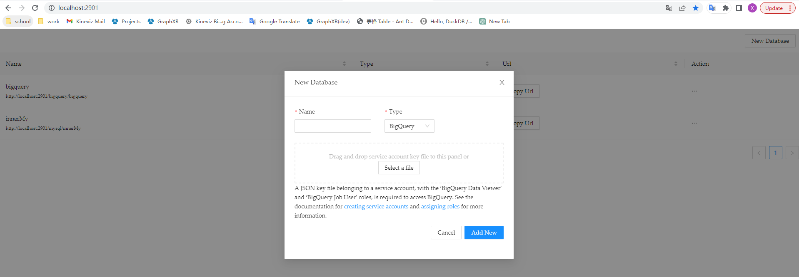

# database-proxy (nodejs)

The database proxy is a simple Node.js webserver that accepts secure requests from your Grove notebooks, and proxies queries to a PostgreSQL or MySQL database — one that is not necessarily exposed to the web. You can use the database proxy to securely connect to databases on your local computer, on an intranet or within a VPN.

## Installation And Run
```
  yarn

  yarn dev

  after startup open browser http://127.0.0.1:2901
```



## Debug the database proxy
- gulp js: complie js files to /java-database-proxy/src/main/webapp
- gulp css: complie css file
- gulp dev: complie js/css file

Usage: `node bin\grove-database-proxy <command> <name> [options]`

Commands:

- `start <name> [ssl options]` Start a database proxy server
- `add <name>` Add a new database proxy configuration
- `remove <name>` Remove an existing database proxy configuration
- `reset <name>` Reset the shared secret for an existing database proxy configuration
- `list` List all configured database proxies

When adding a database proxy configuration, Subsequent starts of the database proxy do not require re-configuration.

Examples:

```
  $ node bin\grove-database-proxy start

  $ node bin\grove-database-proxy add localssl
  $ node bin\grove-database-proxy start --sslcert ~/.ssl/localhost.crt --sslkey ~/.ssl/localhost.key
```

## Configuration storage

All proxy configuration is stored in `./config.json`. You can delete the file to remove all of your database proxy configuration at once.

## SSL Certificates

If you’re using Chrome or Edge, and running the database proxy on your local computer (at 127.0.0.1), you can connect to it directly with HTTP — there’s no need to set up a self-signed SSL certificate for the proxy.

If you’re using Firefox or Safari, or if you wish to run the database proxy on a different computer on your intranet, you can create a self-signed SSL certificate and configure the database proxy to use it in order to proxy over HTTPS. Be sure to “Require SSL/TLS” in the Grove configuration, and specify the `--sslcert` and `--sslkey` options when running the database proxy.

## Using from notebooks

After the proxy is running, in one of your private notebooks, use `DatabaseClient("name")` to create a database client pointed at your local proxy. When querying, your data and database credentials never leave your local computer. Please check [this notebook for more information on how to use it from Grove]

## Test
```
node bin\grove-database-proxy start
```


## Docker image

### Run with docker

```
docker run -d -it --name database-proxy --restart always \
-v $HOME/database-proxy:/data:rw \
-p 2900:2901 \
kineviz/data-proxy:latest
```

### With Proxy (for China)

```
docker run -d -it --name database-proxy --restart always \
-v $HOME/database-proxy:/data:rw \
-p 2900:2901 \
-e "http_proxy=${http_proxy}" \
-e "https_proxy=${https_proxy}" \
kineviz/data-proxy:latest
```

## Send query example (for bigquery)

```
(await fetch("http://localhost:2901/bigquery/:name",{
    method:"POST",
    body:JSON.stringify({
      "sql":"select 'abc' as str" ,
    })
})).json();
```